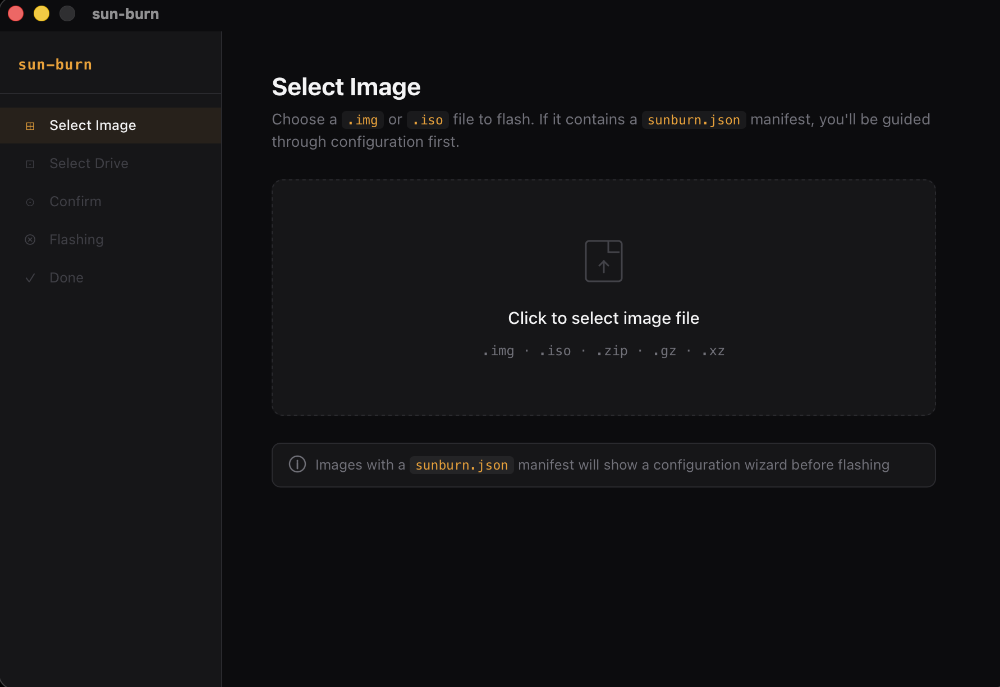
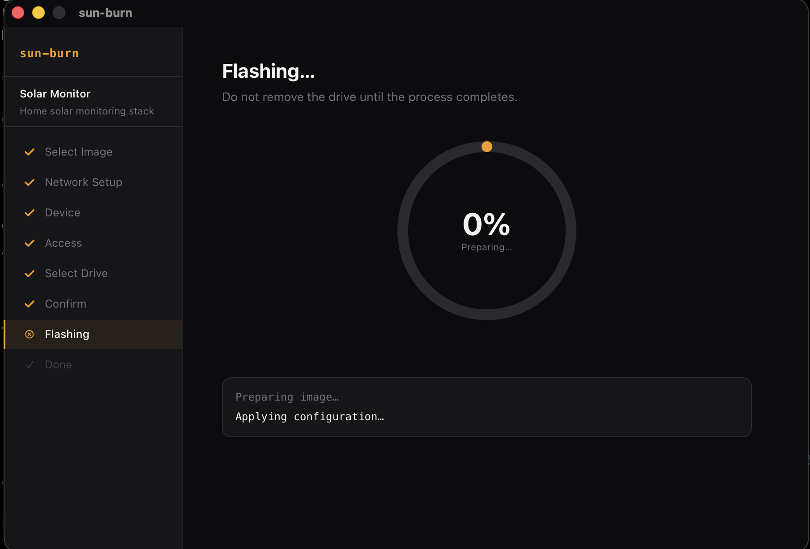

# sun-burn

A manifest-driven image flasher for any OS image.

[](https://github.com/codercodingthecode/sun-burn/actions/workflows/test.yml)
[](https://github.com/codercodingthecode/sun-burn/releases)
[](LICENSE)
[](#download)

---

## What it does

Flash any OS image to an SD card or USB drive. If the image ships a `sunburn.json` manifest, sun-burn shows a setup wizard — WiFi network, device name, SSH access, timezone — so your device is fully configured before it ever boots. No monitor required.

Without a manifest, sun-burn works as a basic flasher: pick image, pick drive, flash.

---

## How it works

1. **Pick an image** — sun-burn mounts the image and checks the boot partition for `sunburn.json`
2. **Manifest found** — guided wizard, steps and fields declared by the image author
3. **No manifest** — straight to drive selection, flash as-is
4. **Flash** — raw disk write with real-time progress, verify on completion

---

## The `sunburn.json` manifest

This is what makes sun-burn generic. Image authors ship a `sunburn.json` in the boot partition (the FAT32 partition). sun-burn reads it and renders the wizard. Users who flash with other tools get the raw image unchanged.

```json
{
  "version": "1",
  "name": "Solar Monitor",
  "description": "Home solar monitoring stack",
  "steps": [
    {
      "id": "network",
      "title": "Network Setup",
      "fields": [
        { "id": "ssid",     "type": "wifi-picker",   "label": "WiFi Network", "required": true },
        { "id": "password", "type": "password",       "label": "Password",     "required": true },
        { "id": "country",  "type": "country-picker", "label": "Country",      "default": "US" }
      ],
      "writes": [
        {
          "path": "wifi.txt",
          "template": "ssid={{ssid}}\npassword={{password}}\ncountry={{country}}"
        }
      ]
    },
    {
      "id": "device",
      "title": "Device",
      "fields": [
        { "id": "hostname", "type": "text",            "label": "Device name", "required": true, "default": "my-device" },
        { "id": "timezone", "type": "timezone-picker", "label": "Timezone",    "default": "auto" }
      ],
      "writes": [
        { "path": "device.txt", "template": "hostname={{hostname}}\ntimezone={{timezone}}" }
      ]
    },
    {
      "id": "access",
      "title": "Access",
      "fields": [
        { "id": "ssh_enabled", "type": "toggle",         "label": "Enable SSH",    "default": "false" },
        { "id": "ssh_key",     "type": "ssh-key-picker", "label": "SSH Public Key",
          "show_when": { "field": "ssh_enabled", "value": "true" } }
      ],
      "writes": [
        { "path": "access.txt", "template": "ssh_enabled={{ssh_enabled}}\nssh_key={{ssh_key}}" }
      ]
    }
  ]
}
```

After each step, sun-burn writes the declared files to the boot partition with `{{field_id}}` placeholders substituted. Fields hidden by `show_when` that were never shown resolve to their `default` or empty string.

Full specification: [`docs/sunburn-manifest-spec.md`](docs/sunburn-manifest-spec.md)

---

## Field types

| Type | Description |
|------|-------------|
| `text` | Plain text input |
| `password` | Masked input |
| `wifi-picker` | Scans nearby networks, shows signal strength |
| `ssh-key-picker` | Reads `~/.ssh/*.pub`, paste or pick |
| `country-picker` | ISO 3166-1 country code dropdown |
| `timezone-picker` | IANA timezone searchable dropdown |
| `toggle` | Boolean on/off switch (`"true"` / `"false"`) |
| `select` | Custom dropdown with author-declared options |

---

## Screenshots

_(screenshots coming soon)_





---

## Download

Download the latest release from [GitHub Releases](https://github.com/codercodingthecode/sun-burn/releases).

| Platform | Installer |
|----------|-----------|
| macOS (Apple Silicon) | `.dmg` (arm64) |
| macOS (Intel) | `.dmg` (x86_64) |
| Windows | `.exe` installer |
| Linux | `.AppImage` |

---

## For image authors

To add guided setup to your image:

1. Place `sunburn.json` at the root of your image's **FAT32 boot partition**
2. Declare steps and fields — see the example above and the [full spec](docs/sunburn-manifest-spec.md)
3. Users who flash with sun-burn get the guided wizard; users who use other flashers get the raw image unchanged — no compatibility cost

The manifest is purely additive. Your image must still read the written files on first boot (e.g. parse `wifi.txt`, apply `hostname`, inject the SSH key). sun-burn writes them; your init system consumes them.

---

## Building from source

Prerequisites: Rust 1.70+, Node 18+, pnpm

```bash
git clone https://github.com/codercodingthecode/sun-burn
cd sun-burn/app
pnpm install
pnpm tauri dev      # dev mode
pnpm build          # release build — outputs .dmg / .exe / .AppImage
```

---

## Architecture

```
crates/
  manifest/          # sunburn.json schema, parser, validator
  image-patcher/     # FAT32 boot partition read/write
  device-enumerator/ # Cross-platform removable drive discovery
  wifi-scanner/      # Cross-platform WiFi network scanning
  flasher/           # Raw disk writer with progress streaming
app/                 # Tauri 2 shell + SolidJS wizard UI
```

Built with [Tauri 2](https://tauri.app) (Rust backend, WebView frontend) and [SolidJS](https://solidjs.com).

---

## Contributing

sun-burn is open source and welcomes contributions. See [CONTRIBUTING.md](CONTRIBUTING.md).

---

## License

MIT
